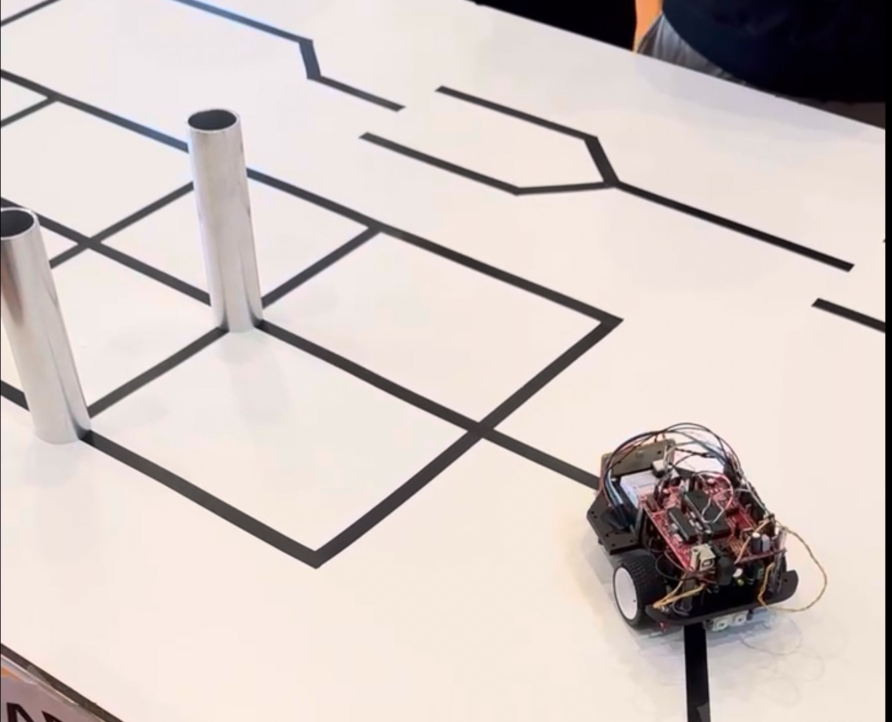
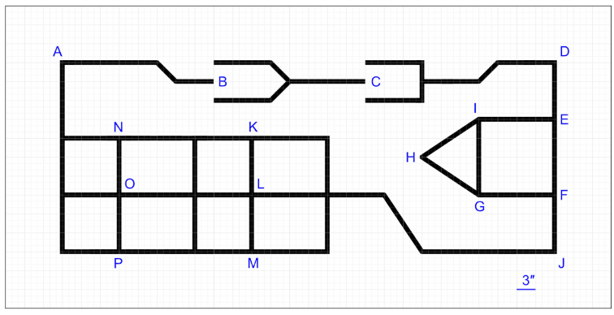
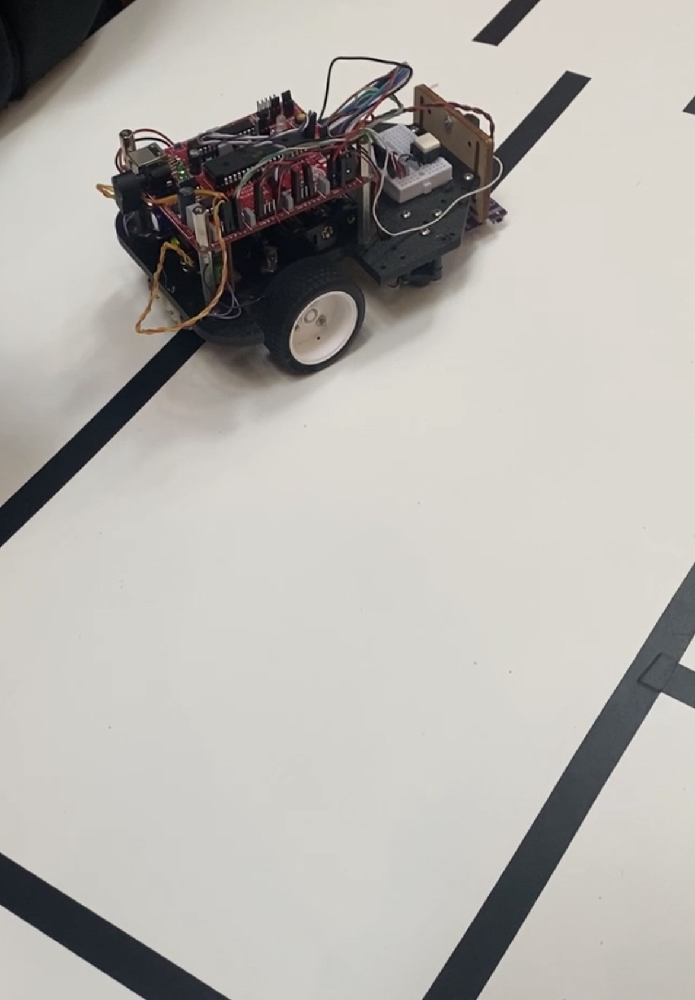

# Autonomous Line-Following Robot

This repository presents a final integrative project completed at Polytechnique Montréal for the INF1900 course. The project focuses on the software development of an autonomous robot built around an ATmega324PA microcontroller.

The robot is designed to follow a black line, detect obstacles, and navigate a predefined course without manual control. It applies embedded systems concepts such as C/C++ programming, sensor integration, PWM-based motor control, timers, and microcontroller-level hardware interaction.

## Final Challenge

The project culminated in an autonomous navigation challenge. The robot had to move through a structured track, handle intersections, react to obstacles, and complete the route using its onboard sensors and control logic.

*Robot navigating a line-following course with obstacle markers.*

## Course Layout

The challenge track includes straight sections, intersections, branching paths, obstacle zones, and grid-like navigation areas.

*Reference layout used for autonomous navigation.*

## Robot Hardware

*Prototype robot platform with the control board, sensors, and motor assembly.*

## Repository Structure

- `lib/` - Low-level modules and reusable components for hardware control, including sensors, motors, timers, communication, interrupts, and utility classes.
- `app/` - Main application logic, including the robot behavior orchestration and the `main.cpp` entry point.

## Technologies Used

- Embedded C/C++
- AVR-GCC
- ATmega324PA microcontroller
- Sensors and motor control

## Additional Resources

This project was completed during the Winter 2025 semester. Course website:

https://cours.polymtl.ca/inf1900/intro/
